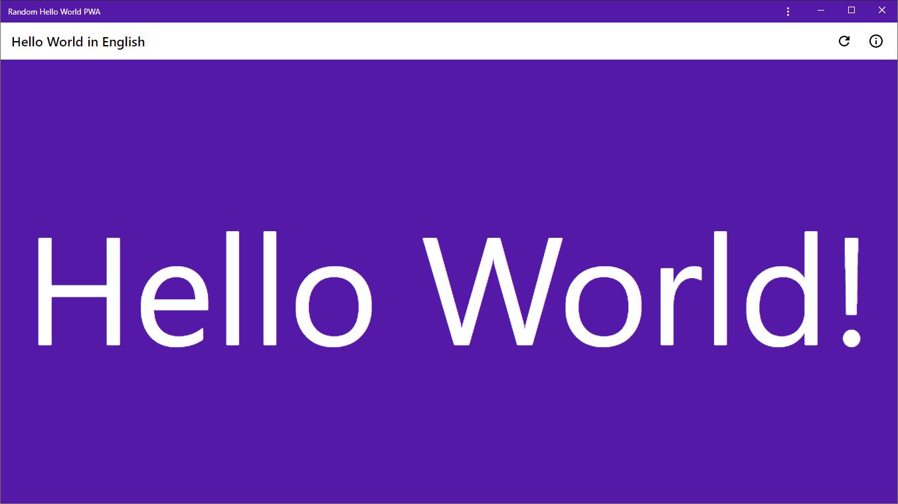

# Random Hello World PWA

Hello World PWA is a multi-language "Hello, World!" Progressive Web App, with random human languages and colors.

### Moved to Glitch: https://glitch.com/~random-hello-world-pwa

   

|  |  |
| ------------- | ------------ |
|  |  |

## Hello World in human languages

Based on the [The Hello World Collection](https://helloworldcollection.github.io/). Please feel free to send pull requests to add new languages or correct the wrong ones.

| Language      | Message      |
| ------------- | ------------ |
| English       | Hello World! |
| Afrikaans     | Hallo, wêreld! |
| Albanian      | Pershëndetje Botë |
| Arabic        | أهلاً بالعالم |
| Armenian      | Բարե՛ւ, աշխարհ։ |
| Azeri         | Salam Dünya |
| Czech         | Ahoj Světe! |
| Basque        | Kaixo mundua! |
| Belarusian    | Прывітанне свет |
| Bemba         | Shani Mwechalo! |
| Bengali       | Shagatam Prithivi! |
| Bosnian       | Zdravo Svijete! |
| Bulgarian     | Здравей, свят! |
| Cambodian     | ជំរាបសួរ ពិភពលោក |
| Catalan       | Hola món! |
| Chinese       | 你好世界 |
| Cherokee      | ᎣᏏᏲ ᎡᎶᎯ |
| Chinook Wawa  | Klahowya Hayas Klaska |
| Croatian      | Bok Svijete! |
| Danish        | Hej, Verden! |
| Dutch         | Hallo, wereld! |
| Esperanto     | Saluton mondo! |
| Estonian      | Tere maailm! |
| Finnish       | Hei maailma! |
| French        | Salut le Monde! |
| Frisian       | Hallo, wrâld! |
| Galician      | Ola mundo! |
| German        | Hallo Welt! |
| Greek         | Γεια σου κόσμε! |
| Hawaiian      | Aloha Honua |
| Hebrew        | שלום עולם |
| Hindi         | नमस्ते दुनिया |
| Hmong         | Nyob zoo ntiaj teb. |
| Hungarian     | Helló világ! |
| Icelandic     | Halló heimur! |
| Igbo          | Ndewo Ụwa |
| Indonesian    | Halo Dunia! |
| Irish         | Dia dhaoibh, a dhomhain! |
| Italian       | Ciao Mondo! |
| Japanese      | こんにちは、 世界！ |
| Kannada       | ಹಲೋ ವರ್ಲ್ಡ್ |
| Kiswahili     | Habari dunia! |
| Kikuyu        | Niatia thi! |
| Klingon       | nuqneH |
| Korean        | 반갑다 세상아 |
| Lao           | ສະບາຍດີ,ໂລກ |
| Latin         | AVE MVNDE |
| Latvian       | Sveika, Pasaule! |
| Lithuanian    | Sveikas, Pasauli |
| Lojban        | coi li terdi |
| Luxembourgish | Moien Welt! |
| Malagasy      | Manao ahoana ry tany! |
| Malayalam     | Namaskaram, lokame |
| Maltese       | Merhba lid-dinja |
| Norwegian     | Hallo verden! |
| Persian       | !سلام دنیا |
| Polish        | Witaj świecie! |
| Portuguese    | Olá, mundo! |
| Punjabi       | ਸਤਿ ਸ੍ਰੀ ਅਕਾਲ ਦੁਨਿਆ |
| Romanian      | Salut lume! |
| Russian       | Здравствуй, мир! |
| Serbian       | Zdravo Svete! |
| Slovak        | Ahoj, svet! |
| Slovenian     | Pozdravljen svet! |
| Spanish       | ¡Hola mundo! |
| Swedish       | Hejsan världen! |
| Tagalog       | Kamusta mundo! |
| Tamil         | ஹலோ உலகம் |
| Telugu        | హలో వరల్డ్ |
| Thai          | สวัสดีโลก! |
| Turkish       | Merhaba Dünya! |
| Ukrainian     | Привiт, свiте! |
| Urdu          | ہیلو دنیا والو |
| Vietnamese    | Xin chào thế giới |
| Welsh         | S'mae byd! |
| Yiddish       | העלא וועלט |
| Zulu          | Sawubona Mhlaba |

## Contributions

Contributions are welcome! For feature requests and bug reports please [submit an issue](https://github.com/TecdropArchive/random-hello-world-pwa/issues).

## License

Random Hello World PWA is licensed under the [MIT License](LICENSE).

